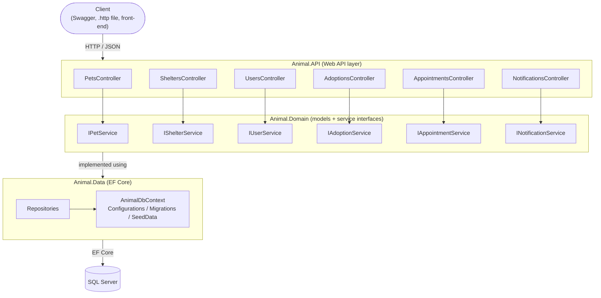
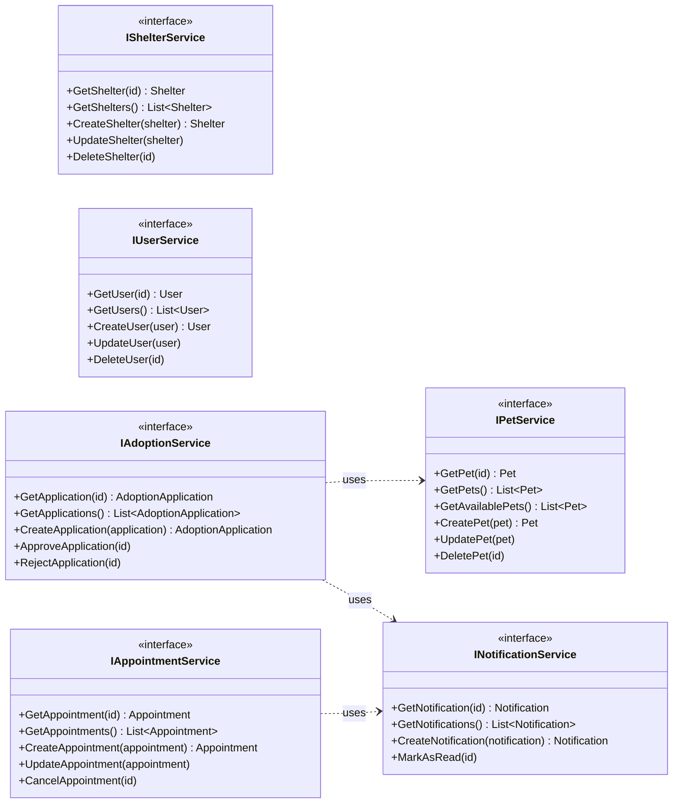
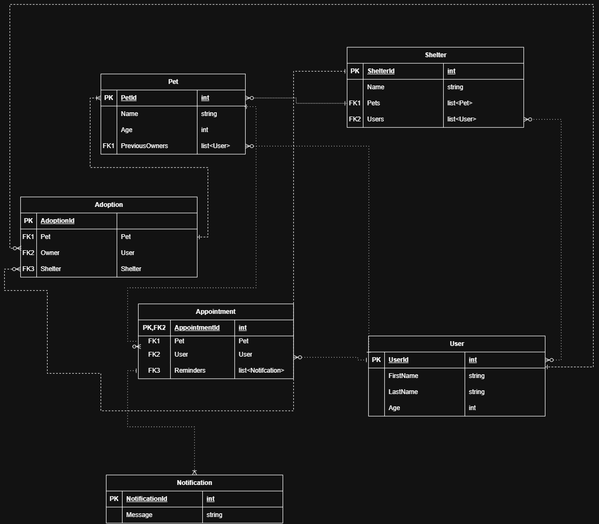

# Animal Adoption API

Team 5 · Web Programming III

An ASP.NET Core Web API (.NET 10) for managing shelters, pets, users, adoption applications, appointments and notifications.

## Repository structure

```
Team-5-Web-Programming/
├── .github/
│   └── workflows/Ci.yml          # build + test + EF migration check on every push / PR to main
├── docs/
│   └── diagrams/                 # service + database diagrams (.mmd sources and .png exports)
├── src/
│   ├── Animal.API/               # Web API: Controllers, Contracts (DTOs), Program.cs
│   ├── Animal.Domain/            # Models (entities) and Services (service interfaces)
│   └── Animal.Data/              # EF Core: Context, Configurations, Migrations, SeedData, Repositories
├── Team-5-Web-Programming.slnx   # solution file, open this in Visual Studio
└── README.md
```

Project references: `Animal.API → Animal.Domain, Animal.Data` and `Animal.Data → Animal.Domain`.

## Service Diagram



### Service interfaces



PNG exports: [service-diagram.png](docs/diagrams/service-diagram.png) · [services-class-diagram.png](docs/diagrams/services-class-diagram.png)

<details>
<summary>Original service diagram sketch</summary>


</details>

## Database Diagram



## Getting started

```bash
dotnet restore Team-5-Web-Programming.slnx
dotnet build Team-5-Web-Programming.slnx
dotnet run --project src/Animal.API
```

The API runs on `http://localhost:5015` (or `https://localhost:7298` with the https profile). The OpenAPI document is served at `/openapi/v1.json` in Development.

## Team conventions

- Branch off `main`, open a pull request, and let CI pass before merging.
- Don't commit `bin/`, `obj/`, `.vs/` or `*.user` files (they're in `.gitignore`).
- Line endings are normalized by `.gitattributes`, so Windows and Mac teammates won't get whole-file diffs.
- To update a diagram, edit the `.mmd` file in `docs/diagrams/`, paste it into the README block, and re-export the PNG (e.g. with https://mermaid.live).
