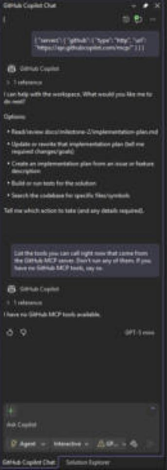
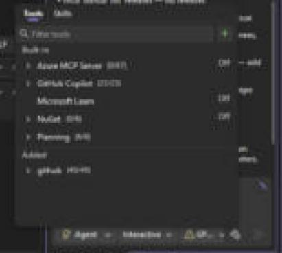
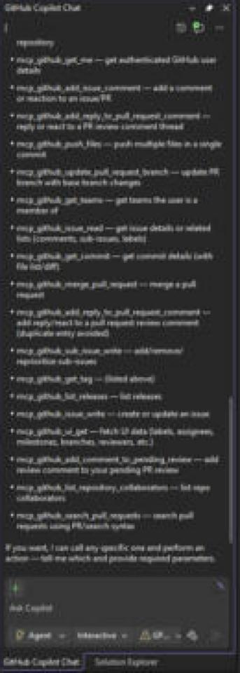

# Step 1: Connect Copilot to GitHub with MCP

Owner: Aiden

## What we set up

Copilot Agent mode talks to GitHub through the official GitHub MCP server. The config is committed in [`.vscode/mcp.json`](../../.vscode/mcp.json), so everyone on the team gets the same server when they open the repo:

```json
{
  "servers": {
    "github": {
      "type": "http",
      "url": "https://api.githubcopilot.com/mcp/"
    }
  }
}
```

This is GitHub's hosted (remote) MCP server. It signs in with your GitHub account through OAuth, so there is no personal access token in the file and nothing secret gets committed.

## How to turn it on

**VS Code**

1. Install the GitHub Copilot and GitHub Copilot Chat extensions and sign in with your GitHub account.
2. Open the repo folder. VS Code finds `.vscode/mcp.json` on its own.
3. Open `.vscode/mcp.json` and click **Start** above the `github` server (or run `MCP: List Servers` from the command palette and start it).
4. Accept the GitHub sign-in prompt.
5. Open Copilot Chat, switch the mode to **Agent**, and click the tools icon. The `github` tools (issues, pull requests, search, and so on) should be listed and checked.

**Visual Studio (2022 17.14 or newer, we used Visual Studio 2026)**

1. Open `Team-5-Web-Programming.slnx`. Visual Studio reads `.mcp.json` from the solution folder, so we added a copy of the same config at the repo root.
2. Open Copilot Chat, pick **Agent** mode, and click the tools icon.
3. Under "Added", the `github` server shows up. If it says Off, click it, pick Restart or Configure, and sign in with GitHub. It should then show 49/49 tools.

## How we checked it works

Ran these prompts in Agent mode. Each one has to call a GitHub MCP tool, not just answer from memory:

| Prompt | Expected result |
|---|---|
| `List the open issues in AidinYaseri/Team-5-Web-Programming.` | Calls the list issues tool and shows the current issues. |
| `Search the code in this repo for IPetService.` | Calls the code search tool and finds `src/Animal.Domain/Services/IPetService.cs`. |
| `List the last 5 pull requests in this repo.` | Shows PRs #6 down to #2. |

## Evidence

Before the fix, Copilot (GPT-5 mini, Agent mode) answered "I have no GitHub MCP tools available.":



After turning the server on, the tool picker shows `github` with 49/49 tools:



Then we asked: `List the tools you can call right now that come from the GitHub MCP server. Don't run any of them. If you have no GitHub MCP tools, say so.` Copilot listed the GitHub tools, including `mcp_github_issue_write`, `mcp_github_list_issues`, `mcp_github_create_pull_request` and `mcp_github_request_copilot_review`, which are the ones we need for steps 2, 3 and 8:



## Problems we hit

- At first Copilot in Visual Studio said it had no GitHub MCP tools, and offered `gh` and curl commands instead. The `github` server was listed in the tool picker but it was Off with 0/49 tools. Restarting the server and signing in fixed it.
- Visual Studio didn't seem to use `.vscode/mcp.json`, so we added `.mcp.json` at the repo root with the same content.

- The tool call has to be approved the first time. Pick "Allow in this workspace" so later steps don't keep asking.
- If the tools don't show up, check that Chat is in **Agent** mode. Ask mode can't use MCP tools.
